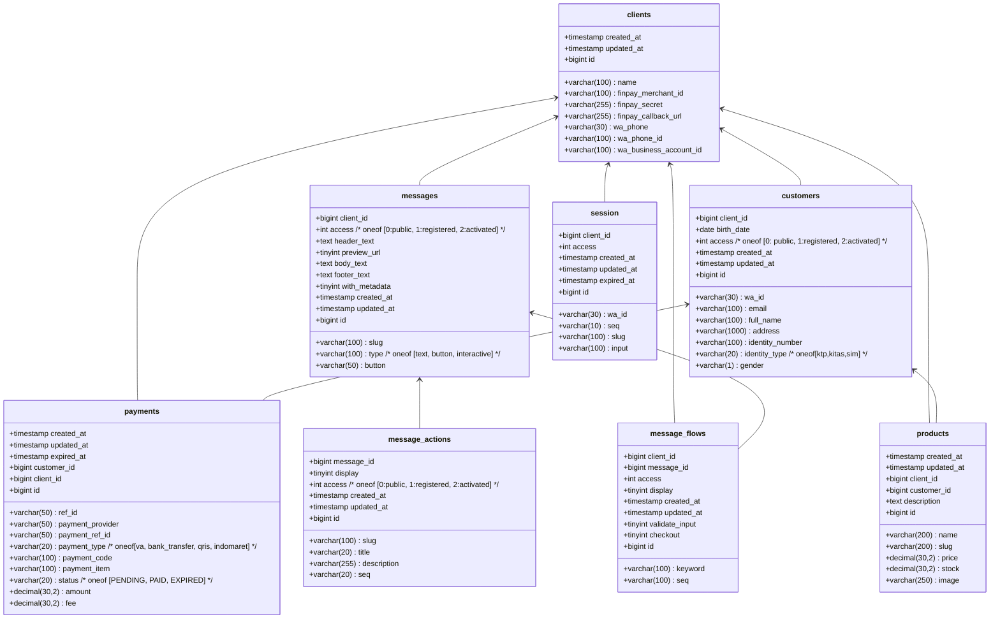

# wabotapi

```mermaid
classDiagram
    direction BT

    class clients {
        +varchar(100) name
        +varchar(100) finpay_merchant_id
        +varchar(255) finpay_secret
        +varchar(255) finpay_callback_url
        +varchar(30) wa_phone
        +varchar(100) wa_phone_id
        +varchar(100) wa_business_account_id
        +timestamp created_at
        +timestamp updated_at
        +bigint id
    }

    class customers {
        +bigint client_id
        +varchar(30) wa_id
        +varchar(100) email
        +varchar(100) full_name
        +varchar(1000) address
        +date birth_date
        +varchar(100) identity_number
        +varchar(20) identity_type  /* oneof[ktp,kitas,sim] */
        +varchar(1) gender
        +int access  /* oneof [0: public, 1:registered, 2:activated] */
        +timestamp created_at
        +timestamp updated_at
        +bigint id
    }

    class message_actions {
        +bigint message_id
        +varchar(100) slug
        +varchar(20) title
        +varchar(255) description
        +tinyint display
        +int access  /* oneof [0:public, 1:registered, 2:activated] */
        +varchar(20) seq
        +timestamp created_at
        +timestamp updated_at
        +bigint id
    }

    class message_flows {
        +bigint client_id
        +varchar(100) keyword
        +bigint message_id
        +int access
        +tinyint display
        +varchar(100) seq
        +timestamp created_at
        +timestamp updated_at
        +tinyint validate_input
        +tinyint checkout
        +bigint id
    }

    class messages {
        +bigint client_id
        +varchar(100) slug
        +varchar(100) type  /* oneof [text, button, interactive] */
        +int access  /* oneof [0:public, 1:registered, 2:activated] */
        +varchar(50) button
        +text header_text
        +tinyint preview_url
        +text body_text
        +text footer_text
        +tinyint with_metadata
        +timestamp created_at
        +timestamp updated_at
        +bigint id
    }

    class payments {
        +timestamp created_at
        +timestamp updated_at
        +timestamp expired_at
        +bigint customer_id
        +varchar(50) ref_id
        +varchar(50) payment_provider
        +varchar(50) payment_ref_id
        +varchar(20) payment_type  /* oneof[va, bank_transfer, qris, indomaret] */
        +varchar(100) payment_code
        +varchar(100) payment_item
        +varchar(20) status  /* oneof [PENDING, PAID, EXPIRED] */
        +decimal(30,2) amount
        +decimal(30,2) fee
        +bigint client_id
        +bigint id
    }

    class products {
        +timestamp created_at
        +timestamp updated_at
        +bigint client_id
        +bigint customer_id
        +varchar(200) name
        +text description
        +varchar(200) slug
        +decimal(30,2) price
        +decimal(30,2) stock
        +varchar(250) image
        +bigint id
    }

    class session {
        +bigint client_id
        +varchar(30) wa_id
        +int access
        +varchar(10) seq
        +varchar(100) slug
        +varchar(100) input
        +timestamp created_at
        +timestamp updated_at
        +timestamp expired_at
        +bigint id
    }

    customers --> clients
    message_actions --> messages
    message_flows --> clients
    message_flows --> messages
    messages --> clients
    payments --> clients
    payments --> customers
    products --> clients
    products --> customers
    session --> clients

```
